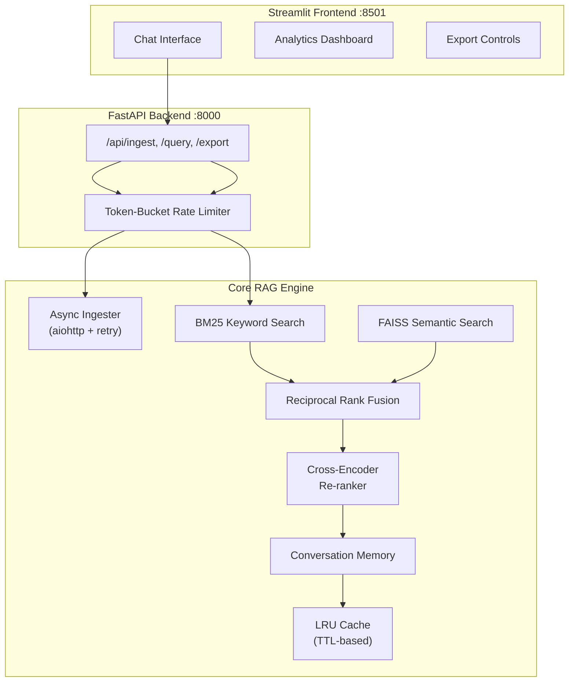

# Equity Research Tool 📈

[](https://www.python.org/downloads/)
[](#testing)
[](LICENSE)
[](#docker)

A **production-grade news research tool** for equity analysts. Combines **hybrid retrieval** (BM25 + FAISS + Cross-Encoder Re-ranking) with LLM-powered answer synthesis, conversation memory, and a RESTful API — built with engineering practices expected at top-tier tech companies.

## Architecture



## Key Features

| Feature | Description |
|---|---|
| **Hybrid Retrieval** | BM25 keyword + FAISS semantic search, fused via Reciprocal Rank Fusion (RRF) |
| **Cross-Encoder Re-ranking** | Precision re-scoring of candidates using `ms-marco-MiniLM` |
| **Conversation Memory** | 5-turn sliding window for multi-turn follow-up questions |
| **Async Ingestion** | Concurrent URL fetching with `aiohttp` and exponential backoff (1s → 2s → 4s) |
| **LRU Cache** | TTL-based query cache with hit/miss metrics for analytics |
| **FastAPI Backend** | RESTful API with Pydantic validation, rate limiting, and health checks |
| **Export** | JSON, CSV, and Markdown research report formats |
| **Analytics Dashboard** | Real-time metrics: response times, cache hit rates, chunk statistics |
| **Docker** | Multi-stage build with non-root user and health checks |
| **CI/CD** | GitHub Actions: lint → test (with coverage) → Docker build |

## Quick Start

### Docker (Recommended)

```bash
# Clone and configure
git clone https://github.com/artorias-66/News-Research-Tool.git
cd News-Research-Tool
cp .env.example .env  # Add your API keys

# Start both services
docker-compose up --build

# API: http://localhost:8000/docs
# UI:  http://localhost:8501
```

### Manual Setup

```bash
# Create virtual environment
python -m venv venv
source venv/bin/activate  # or venv\Scripts\activate on Windows

# Install dependencies
pip install -r requirements.txt

# Start API server
uvicorn api.main:app --port 8000

# Start Streamlit (separate terminal)
streamlit run app.py
```

### Standalone Mode (Streamlit only)

```bash
streamlit run app.py
```

## API Reference

| Method | Endpoint | Description |
|---|---|---|
| `GET` | `/api/health` | Health check + index status |
| `GET` | `/api/metrics` | Cache stats + system metrics |
| `POST` | `/api/ingest` | Process URLs → chunk → embed → index |
| `POST` | `/api/query` | Query the RAG pipeline |
| `POST` | `/api/export` | Export research data (JSON/CSV/Report) |

### Example: Ingest URLs

```bash
curl -X POST http://localhost:8000/api/ingest \
  -H "Content-Type: application/json" \
  -d '{"urls": ["https://example.com/article"], "chunk_size": 1000}'
```

### Example: Query

```bash
curl -X POST http://localhost:8000/api/query \
  -H "Content-Type: application/json" \
  -d '{"question": "What were the key findings?", "provider": "google", "api_key": "your-key"}'
```

## Testing

```bash
# Run all tests with coverage
pytest tests/ -v --cov=src --cov=api --cov-report=term-missing

# Run specific test module
pytest tests/test_retriever.py -v
```

## Project Structure

```
├── api/                     # FastAPI backend
│   ├── main.py              #   App + endpoints + Pydantic models
│   └── middleware.py         #   Rate limiter + auth
├── src/                     # Core engine
│   ├── ingest.py            #   Async URL ingestion + retry
│   ├── retriever.py         #   Hybrid BM25+FAISS+RRF+Reranker
│   ├── rag.py               #   RAG pipeline + conversation memory
│   ├── vector_store.py      #   FAISS index management
│   ├── cache.py             #   LRU cache with TTL
│   ├── export.py            #   JSON/CSV/Markdown export
│   ├── exceptions.py        #   Custom exception hierarchy
│   ├── utils.py             #   Helpers + validators
│   └── ui.py                #   Streamlit components
├── tests/                   #   30+ pytest unit tests
├── .github/workflows/       #   CI/CD pipeline
├── app.py                   # Streamlit frontend
├── Dockerfile               # Multi-stage build
├── docker-compose.yml       # API + Frontend services
└── requirements.txt
```

## Tech Stack

- **Backend**: FastAPI, LangChain, FAISS, BM25 (rank-bm25), sentence-transformers
- **Frontend**: Streamlit
- **AI/ML**: Google Gemini / OpenAI GPT, HuggingFace Embeddings, Cross-Encoder Re-ranking
- **Infra**: Docker, GitHub Actions, aiohttp

---

*Built by [Anubhav Verma](https://github.com/artorias-66)*
