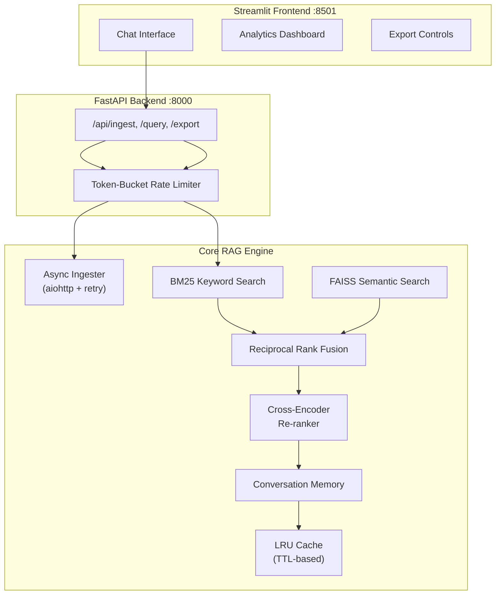

# Equity Research Tool 📈

[](https://www.python.org/downloads/)
[](#testing)
[](https://github.com/artorias-66/News-Research-Tool/actions)
[](LICENSE)
[](https://sage-news-research-tool.streamlit.app/)

A **production-grade news research tool** for equity analysts. Combines **hybrid retrieval** (BM25 + FAISS + Cross-Encoder Re-ranking) with Groq-powered LLM answer synthesis, conversation memory, and a RESTful API.

🚀 **[Live Demo → sage-news-research-tool.streamlit.app](https://sage-news-research-tool.streamlit.app/)**

## Architecture



## Key Features

| Feature | Description |
|---|---|
| **Hybrid Retrieval** | BM25 keyword + FAISS semantic search, fused via Reciprocal Rank Fusion (RRF) |
| **Cross-Encoder Re-ranking** | Precision re-scoring of candidates using `ms-marco-MiniLM` |
| **Groq LLM** | Ultra-fast inference via `llama-3.3-70b-versatile` (Groq API) |
| **Conversation Memory** | 5-turn sliding window for multi-turn follow-up questions |
| **Async Ingestion** | Concurrent URL fetching with `aiohttp` and exponential backoff |
| **LRU Cache** | TTL-based query cache with hit/miss metrics |
| **FastAPI Backend** | RESTful API with Pydantic v2, rate limiting, and health checks |
| **Export** | JSON, CSV, and Markdown research report formats |
| **Analytics Dashboard** | Real-time metrics: response times, cache hit rates, chunk statistics |
| **Docker** | Multi-stage build with non-root user and health checks |
| **CI/CD** | GitHub Actions: lint → test (87 tests, 70%+ coverage) → Docker build |

## Quick Start

### Streamlit Cloud (Deployed)

👉 **[sage-news-research-tool.streamlit.app](https://sage-news-research-tool.streamlit.app/)**

### Local — Docker (Recommended)

```bash
git clone https://github.com/artorias-66/News-Research-Tool.git
cd News-Research-Tool
cp .env.example .env      # Add your GROQ_API_KEY

docker-compose up --build
# API: http://localhost:8000/docs
# UI:  http://localhost:8501
```

### Local — Manual Setup

```bash
python -m venv venv
source venv/bin/activate        # Windows: venv\Scripts\activate
pip install -r requirements.txt

# Set your Groq API key
echo GROQ_API_KEY=your_key_here > .env

streamlit run app.py            # UI at http://localhost:8501
uvicorn api.main:app --port 8000  # API (optional)
```

## Configuration

The app reads the LLM API key from the environment — no UI input required.

| Variable | Description | Default |
|---|---|---|
| `GROQ_API_KEY` | **Required.** Groq API key | — |
| `GROQ_MODEL` | Groq model to use | `llama-3.3-70b-versatile` |

Get a free Groq key at [console.groq.com](https://console.groq.com).

## API Reference

| Method | Endpoint | Description |
|---|---|---|
| `GET` | `/api/health` | Health check + index status |
| `GET` | `/api/metrics` | Cache stats + system metrics |
| `POST` | `/api/ingest` | Process URLs → chunk → embed → index |
| `POST` | `/api/query` | Query the RAG pipeline |
| `POST` | `/api/export` | Export research data (JSON/CSV/Report) |

### Example: Ingest URLs

```bash
curl -X POST http://localhost:8000/api/ingest \
  -H "Content-Type: application/json" \
  -d '{"urls": ["https://example.com/article"], "chunk_size": 1000}'
```

### Example: Query

```bash
curl -X POST http://localhost:8000/api/query \
  -H "Content-Type: application/json" \
  -d '{"question": "What were the key findings?"}'
```

## Testing

```bash
# Run all 87 tests with coverage
pytest tests/ -v --cov=src --cov=api --cov-report=term-missing

# Lint check
flake8 src/ api/ tests/ --max-line-length=120 --ignore=E501,W503
```

## Project Structure

```
├── api/                     # FastAPI backend
│   ├── main.py              #   App + endpoints + Pydantic models
│   └── middleware.py        #   Rate limiter
├── src/                     # Core engine
│   ├── ingest.py            #   Async URL ingestion + retry
│   ├── retriever.py         #   Hybrid BM25+FAISS+RRF+Reranker
│   ├── rag.py               #   RAG pipeline + conversation memory
│   ├── vector_store.py      #   FAISS index management
│   ├── cache.py             #   LRU cache with TTL
│   ├── export.py            #   JSON/CSV/Markdown export
│   ├── exceptions.py        #   Custom exception hierarchy
│   ├── utils.py             #   Helpers + validators
│   └── ui.py                #   Streamlit components
├── tests/                   #   87 pytest unit tests
├── .github/workflows/       #   CI/CD pipeline
├── app.py                   # Streamlit frontend entry point
├── Dockerfile               # Multi-stage build
├── docker-compose.yml       # API + Frontend services
└── requirements.txt
```

## Tech Stack

- **LLM**: Groq (`llama-3.3-70b-versatile`) via LangChain
- **Retrieval**: FAISS, BM25 (`rank-bm25`), `sentence-transformers`, cross-encoder re-ranking
- **Backend**: FastAPI, Pydantic v2, aiohttp
- **Frontend**: Streamlit
- **Infra**: Docker, GitHub Actions

---

*Built by [Anubhav Verma](https://github.com/artorias-66)*
